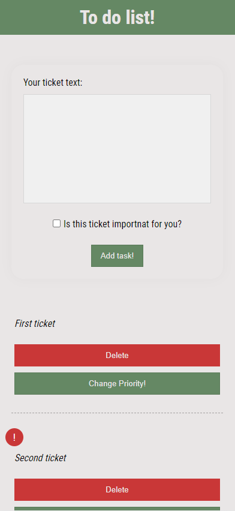
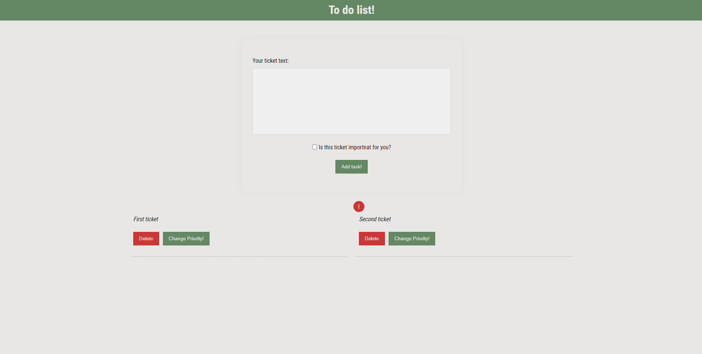

## To do list

### Tech stack

<ul>
    <li>Vue</li>
    <li>HTML</li>
    <li>CSS</li>
    <li>JavaScript</li>
</ul>

 
 

### Functionality

Thanks to that app you can create list with your task, you can also delate old task and change priority of existing ones

 
 

### How it looks like:

<strong>Mobile:</strong>

 
 
 
<strong>Desktop</strong>

